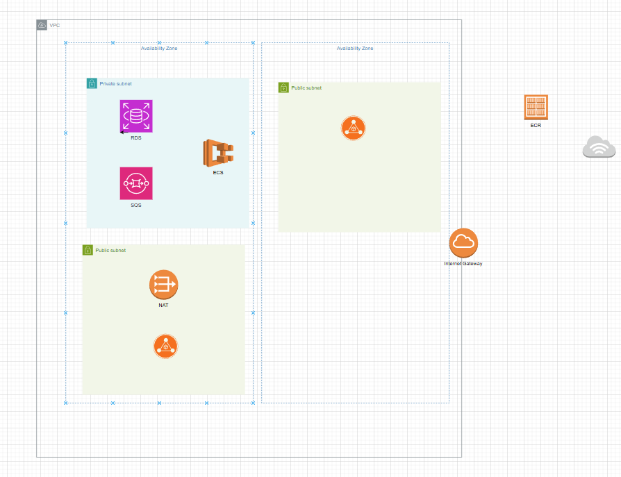

### order-service
# AWS Architecture Project

## Overview
This project outlines a scalable AWS architecture for deploying a web application using various AWS services. The architecture ensures secure communication, scalability, and efficient resource management within a Virtual Private Cloud (VPC).

## Architecture Diagram
The architecture is divided into a VPC with private and public subnets across an Availability Zone.

### Components
- **VPC**: The entire infrastructure is hosted within a Virtual Private Cloud (VPC) for network isolation.
- **Private Subnet**:
  - **Amazon ECS**: Hosts the containerized application using Elastic Container Service (ECS).
  - **Amazon RDS**: Provides a relational database service for persistent data storage.
  - **Amazon SQS**: Manages message queuing for asynchronous communication between components.
  - **NAT Gateway**: Allows private subnet resources to access the internet securely for updates or external API calls.
  - **Amazon ECR**: Stores Docker container images in the Elastic Container Registry (ECR).
- **Public Subnet**:
  - **Application Load Balancer (ALB)**: Distributes incoming traffic to ECS instances for load balancing and high availability.
  - **API Gateway**: Serves as the entry point for external API requests, routing them to the appropriate backend services.
- **Internet**: External traffic enters the system via the internet, interacting with the API Gateway and ALB.

Details:
vpc:
name: of vpc - kbm-vpc
tag:kbm-vpc
cider block: 10.0.0.0/24

there will be two subnet public and private

public subnet:

public-kbm-subnet-1a:
IPv4 subnet CIDR block: 10.0.0.0/28
tag: public-kbm-subnet-1a
add auto assign public ip

private subnet:

private-kbm-subnet-1a:
IPv4 subnet CIDR block: 10.0.0.16/28
tag: private-kbm-subnet-1a

route table:
for public subnet:
public-kbm-subnet-route
add 0.0.0.0/0 and the internet gateway
and before created this i created internet gateway and associate it with the vpc
so all of the traffic that comes will be hit the internet gateway 
i have associate the subnet with this route table

Nat Gateway:
created in public subnet 
attach elastic ip 

ECS:
Created cluster:
before creating cluster create a role for it

created task definition:
name - kbm-ecs-task-def
run on - fargat
before creating TD i have created role for it

